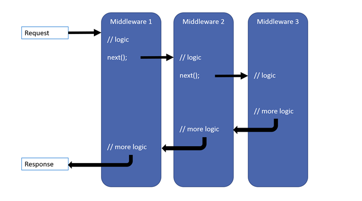
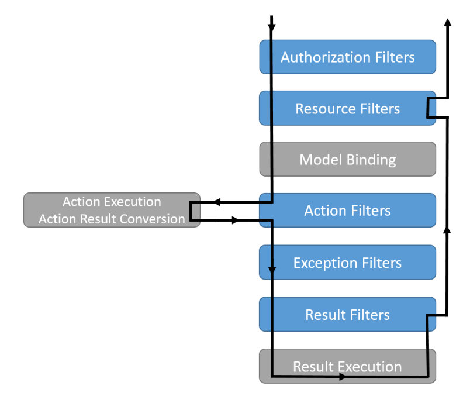
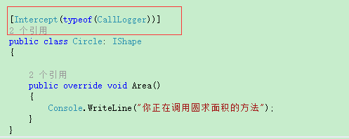

# [.Net中AOP的运用](https://developer.aliyun.com/article/665176)
## 原生
1. 中间件(Middleware)
    1. 图示: 
    2. 代码示例
        ```C#
        public static class InterceptHandler
        {
            public static IApplicationBuilder UseInterceptMiddleware(this IApplicationBuilder app)
            {
                return app.UseMiddleware<InterceptMiddlware>();
            }
        }
        ```
        ```C#
        using System;
        using System.Threading.Tasks;
        using Microsoft.AspNetCore.Http;
        
        namespace InterceptDemo.Intercepts.Middleware
        {
            public class InterceptMiddlware
            {
                private readonly RequestDelegate _next;
                
                public InterceptMiddlware(RequestDelegate next)
                {
                    _next = next;
                }
        
                public async Task Invoke(HttpContext context)
                {
                    PreProceed(context);
                    await _next(context);
                    PostProceed(context);
                }
        
                private void PreProceed(HttpContext context)
                {
                    Console.WriteLine($"{DateTime.Now} middleware invoke preproceed");
                }
        
                private void PostProceed(HttpContext context)
                {
                    Console.WriteLine($"{DateTime.Now} middleware invoke postproceed");
                }
            }
        }
        ```
2. 过滤器(Filter)
    1. .NetCore请求管道图示: 
    2. 代码示例
        ```C#
        public class ActionFilter : ActionFilterAttribute
        {
            public override void OnActionExecuting(ActionExecutingContext context)
            {
                Console.WriteLine($"{DateTime.Now} on action exceuting");
            }
    
            public override void OnActionExecuted(ActionExecutedContext context)
            {
                Console.WriteLine($"{DateTime.Now} on action exceuted");
            }
        }
        ```

## Castle.DynamicProxy
1. 参考文档: https://www.cnblogs.com/youring2/p/10962573.html
2. 引用三个包
   1. ``Autofac``
   2. ``Autofac.Extras.DynamicProxy``
   3. ``Castle.Core``
3. 创建一个拦截器
   ```C#
   /// <summary>
    /// 拦截器 需要实现 IInterceptor接口 Intercept方法
    /// </summary>
    public class CallLogger: IInterceptor
    {
        TextWriter _output;

        public CallLogger(TextWriter output)
        {
            _output = output;
        }

        /// <summary>
        /// 拦截方法 打印被拦截的方法执行前的名称、参数和方法执行后的 返回结果
        /// </summary>
        /// <param name="invocation">包含被拦截方法的信息</param>
        public void Intercept(IInvocation invocation)
        {

            _output.WriteLine("你正在调用方法 \"{0}\"  参数是 {1}... ",
              invocation.Method.Name,
              string.Join(", ", invocation.Arguments.Select(a => (a ?? "").ToString()).ToArray()));

            //在被拦截的方法执行完毕后 继续执行
            invocation.Proceed();

            _output.WriteLine("方法执行完毕，返回结果：{0}", invocation.ReturnValue);
        }
    }
   ```
4. 注册拦截器到Autofac容器
   ```C#
   // 命名注入
    builder.Register(c => new CallLogger(Console.Out))
            .Named<IInterceptor>("log-calls");

    // 类型注入
    builder.Register(c => new CallLogger(Console.Out));
   ```
5. 启用拦截器
   ```C#
    //启用类代理拦截, 只会重写虚方法
    builder.RegisterType<Circle>().EnableClassInterceptors();
    //启用接口代理拦截
    builder.RegisterType<Circle>().EnableInterfaceInterceptors();
   ```
6. 指明要拦截的类型
   1. 使用``InterceptAttribute``
        
   2. 启用拦截器时就选择拦截器
      ```C#
      //动态注入拦截器CallLogger
      builder.RegisterType<Circle>().InterceptedBy(typeof(CallLogger)).EnableClassInterceptors();
      ```